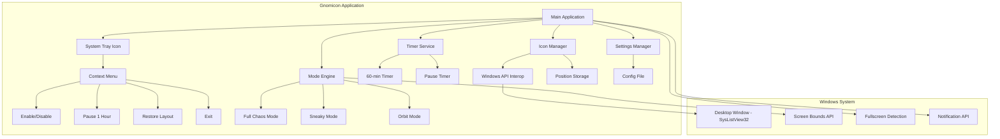

# Gnomicon - System Architecture

## Overview
Gnomicon is a lightweight Windows background application that playfully rearranges desktop icons at regular intervals. It lives in the system tray and provides various modes of icon manipulation.

## System Architecture



## Core Components

### 1. Windows API Interop (`DesktopIconManager`)
- **FindDesktopWindow()**: Locates the desktop ListView control (SysListView32)
- **GetIconPositions()**: Reads current icon positions using LVM_GETITEMPOSITION
- **SetIconPositions()**: Sets new icon positions using LVM_SETITEMPOSITION
- **GetIconCount()**: Returns number of desktop icons

### 2. Mode Engine (`RearrangementEngine`)
- **Full Chaos**: Randomizes all icon positions within screen bounds
- **Sneaky**: Randomly swaps 2-4 icon positions
- **Orbit**: Rotates icons in a circular pattern around screen center

### 3. Safety Manager (`SafetyChecker`)
- **IsFullscreenAppRunning()**: Detects if any application is in fullscreen mode
- **ValidatePosition()**: Ensures icons stay within visible screen area
- **Screen Bounds Detection**: Accounts for taskbar and screen resolution

### 4. Settings Manager (`SettingsManager`)
- Saves/loads original icon positions to JSON file
- Stores user preferences (enabled/disabled, current mode)
- Persists pause state

## Icon Positioning Mechanics

### How Desktop Icons Work in Windows
1. The desktop is actually a ListView control (class name: `SysListView32`)
2. It's a child of the "Progman" window (Program Manager)
3. Each icon is a ListView item with x,y coordinates
4. Windows messages are used to manipulate positions:
   - `LVM_GETITEMPOSITION` (0x1010) - Get position
   - `LVM_SETITEMPOSITION` (0x100F) - Set position
   - `LVM_GETITEMCOUNT` (0x1004) - Get icon count

### API Flow
```
1. FindWindow("Progman", null)
2. FindWindowEx(progman, null, "SHELLDLL_DefView", null)
3. FindWindowEx(shellView, null, "SysListView32", null)
4. SendMessage(listView, LVM_GETITEMCOUNT, 0, 0) → icon count
5. SendMessage(listView, LVM_GETITEMPOSITION, index, ref point) → position
6. SendMessage(listView, LVM_SETITEMPOSITION, index, MAKELPARAM(x, y)) → set position
```

## Data Structures

### IconPosition
```csharp
public struct IconPosition
{
    public int Index { get; set; }
    public int X { get; set; }
    public int Y { get; set; }
    public string Name { get; set; } // Optional, for debugging
}
```

### AppSettings
```csharp
public class AppSettings
{
    public bool IsEnabled { get; set; }
    public RearrangementMode Mode { get; set; }
    public DateTime? PauseUntil { get; set; }
    public List<IconPosition> OriginalPositions { get; set; }
}
```

### RearrangementMode Enum
```csharp
public enum RearrangementMode
{
    FullChaos,
    Sneaky,
    Orbit
}
```

## Safety Features

1. **Screen Bounds Checking**: All positions validated against `Screen.WorkingArea`
2. **Fullscreen Detection**: Uses `SHQueryUserNotificationState` or checks foreground window bounds
3. **Icon Overlap Prevention**: Minimum spacing between icons (48x48 pixels typical)
4. **Graceful Degradation**: If API calls fail, app continues without crashing

## Timer Strategy

- **Main Timer**: 60-minute interval for rearrangement
- **Pause Timer**: 1-hour countdown when paused
- **No Polling**: Uses System.Windows.Forms.Timer for minimal CPU usage
- **Smart Scheduling**: Checks fullscreen state before rearranging

## File Structure

```
Gnomicon/
├── Gnomicon.csproj
├── Program.cs
├── MainForm.cs (hidden, hosts tray icon)
├── DesktopIconManager.cs (Windows API interop)
├── RearrangementEngine.cs (mode implementations)
├── SafetyChecker.cs (fullscreen detection)
├── SettingsManager.cs (config persistence)
├── TrayManager.cs (system tray UI)
└── NotificationManager.cs (toast notifications)
```

## Build Requirements

- .NET 6.0 or later (Windows Desktop runtime)
- Windows 10/11 SDK
- Platform target: x64 or x86 (must match Windows bitness)

## Configuration File

Stored at: `%LOCALAPPDATA%\Gnomicon\settings.json`

```json
{
  "isEnabled": true,
  "mode": "FullChaos",
  "pauseUntil": null,
  "originalPositions": [
    {"index": 0, "x": 100, "y": 100, "name": "Recycle Bin"},
    ...
  ]
}
```
