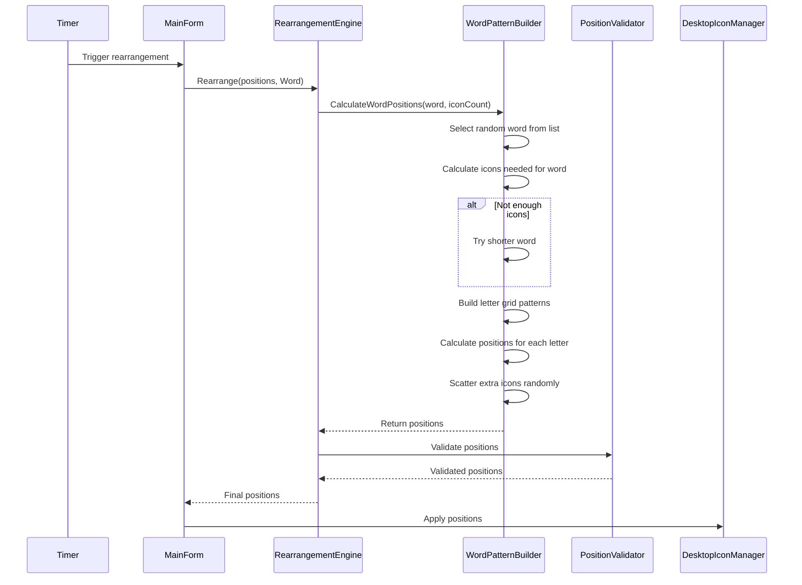

# Word Mode Feature Implementation Plan

## Overview
This feature will add a new rearrangement mode called "Word Mode" that arranges desktop icons to spell out fun words like LOL, LMAO, WOW, etc. using a variable-grid letter pattern system.

## Feature Requirements (Confirmed with User)

- **Word Selection**: Random word from predefined list each time rearrangement occurs
- **Letter Formation**: Variable icons per letter based on complexity (O=5, I=3, etc.)
- **Extra Icons**: Icons not needed for the word will be scattered randomly
- **Fallback**: If not enough icons for a word, try a shorter word from the list

## Implementation Steps

### Step 1: Create WordModeConstants.cs
A new file containing:
- **Predefined Word List**: Fun words like LOL, LMAO, WOW, OK, HI, BYE, YES, NO, WOW, HAHA, etc.
- **Letter Patterns**: Dictionary mapping each letter to its icon grid pattern
  - Simple letters (I, L, T): 3 icons in a line
  - Medium letters (A, E, O): 4-5 icons in various patterns
  - Complex letters (B, M, W): 6+ icons for clarity
- **Grid Configuration**: Icon spacing and letter spacing constants

### Step 2: Update RearrangementMode.cs
Add `Word` to the enum:
```csharp
public enum RearrangementMode
{
    FullChaos,
    Sneaky,
    Orbit,
    Word  // NEW
}
```

### Step 3: Update RearrangementModeExtensions.cs
Add display name and description for Word mode:
- **Display Name**: "Word Mode"
- **Description**: "Arranges icons to spell out fun words"

### Step 4: Create WordPatternBuilder.cs
A utility class that:
- Calculates letter positions based on available icons
- Builds the grid pattern for each letter
- Handles spacing between letters and rows
- Falls back to shorter words if not enough icons

### Step 5: Add WordRearrangement Method to RearrangementEngine.cs
The core logic:
1. Select a random word from the list
2. Calculate total icons needed for the word
3. If insufficient icons, try shorter word or partial word
4. Position icons in letter patterns
5. Scatter remaining icons randomly
6. Return validated positions

### Step 6: Update RearrangementEngine.Rearrange Method
Add Word mode to the switch statement:
```csharp
public List<IconPosition> Rearrange(List<IconPosition> currentPositions, RearrangementMode mode)
{
    return mode switch
    {
        RearrangementMode.FullChaos => FullChaos(currentPositions),
        RearrangementMode.Sneaky => Sneaky(currentPositions),
        RearrangementMode.Orbit => Orbit(currentPositions),
        RearrangementMode.Word => WordRearrangement(currentPositions),
        _ => currentPositions
    };
}
```

### Step 7: Update MainForm.cs
Add Word Mode option to tray menu:
- Add menu item for "Word Mode" toggle
- Update mode cycling if applicable
- Show current word in notification (optional enhancement)

### Step 8: Testing Scenarios
- Word with enough icons (LOL with 15+ icons available)
- Word with barely enough icons (LMAO with minimum icons)
- Word with too many icons (extra icons scattered randomly)
- Very short word with many icons
- Icon count equals word requirements exactly

## Letter Pattern Design

### Icon Grid System
Each letter will be formed using a simplified dot-matrix pattern:

```
Simple (3 icons):
I:  •      L:  •      T:  ••
     •          •          •
     •          •          •

Medium (4-5 icons):
O:  ••       A:  ••       E:  ••
    •  •       •  •       ••
    •  •       •  •       ••
    ••         ••         ••

Complex (6-7 icons):
M:  •  •    W:  •  •    B:  •••
   •• ••      •  •  •    •• •
   •  •       •  •  •    •• •
               •• ••      •••
```

## Data Structure for Letter Patterns

```csharp
public static class LetterPatterns
{
    public static Dictionary<char, List<(int row, int col)>> Patterns = new()
    {
        ['A'] = new() { (0,1), (1,0), (1,2), (2,0), (2,1), (2,2) },
        ['B'] = new() { (0,0), (0,1), (0,2), (1,0), (1,1), (1,2), (2,0), (2,1), (2,2), (3,0), (3,1), (3,2) },
        // ... more patterns
    };
    
    public static Dictionary<char, int> IconCounts = new()
    {
        ['A'] = 6, ['B'] = 12, ['C'] = 5, ['D'] = 7, ['E'] = 7,
        ['F'] = 5, ['G'] = 6, ['H'] = 6, ['I'] = 3, ['J'] = 4,
        ['K'] = 5, ['L'] = 3, ['M'] = 8, ['N'] = 6, ['O'] = 5,
        ['P'] = 5, ['Q'] = 6, ['R'] = 6, ['S'] = 6, ['T'] = 3,
        ['U'] = 5, ['V'] = 4, ['W'] = 8, ['X'] = 4, ['Y'] = 4,
        ['Z'] = 5
    };
}
```

## Word List

```csharp
public static class FunWords
{
    public static readonly string[] Words = new[]
    {
        "LOL", "LMAO", "WOW", "OK", "HI", "BYE", "YES", "NO",
        "HAHA", "OMG", "WIN", "FAIL", "NICE", "COOL", "CUTE",
        "EPIC", "BOSS", "GGWP", "FTW", "MVP", "LOVE", "HATE",
        "GOOD", "BAD", "HOT", "SAD", "MAD", "FUN", "GAME"
    };
}
```

## File Changes Summary

| File | Change Type | Description |
|------|-------------|-------------|
| `RearrangementMode.cs` | Modified | Add `Word` enum value |
| `RearrangementModeExtensions.cs` | Modified | Add Word mode display name/description |
| `WordModeConstants.cs` | **NEW** | Contains word list and letter patterns |
| `WordPatternBuilder.cs` | **NEW** | Calculates letter positions |
| `RearrangementEngine.cs` | Modified | Add WordRearrangement method |
| `MainForm.cs` | Modified | Add Word Mode to tray menu |
| `plans/architecture.md` | Modified | Update architecture diagram |

## Sequence Diagram



## Ready for Implementation
This plan is complete and ready to be executed. The implementation will follow the existing code patterns and architecture while adding the new Word Mode feature.
